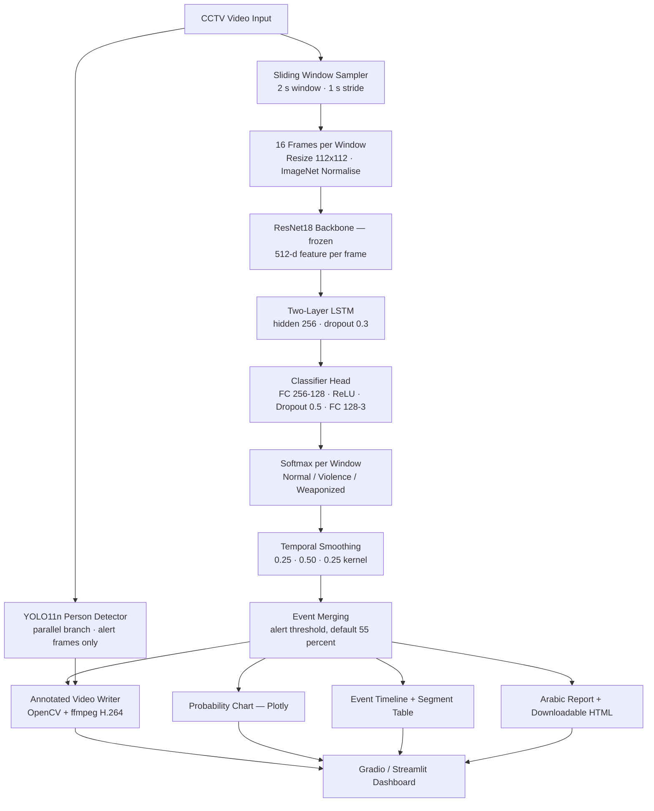

<p align="center">
  
</p>

# SCVD — Smart-City CCTV Violence Detection

> A deep-learning surveillance analytics system that classifies CCTV footage as **Normal**, **Violence**, or **Weaponized**, localises *when* each incident happens on a timeline, and produces an explainable, downloadable review report.

<p align="center">
  
  
  
  
</p>
<p align="center">
  
  
  
  
</p>

---

## Table of Contents

- [Overview](#overview)
- [Key Features](#key-features)
- [System Workflow](#system-workflow)
- [Architecture](#architecture)
- [Architecture Explained](#architecture-explained)
- [Screenshots](#screenshots)
- [Model Details](#model-details)
- [Dataset](#dataset)
- [Results](#results)
- [Technologies](#technologies)
- [Project Structure](#project-structure)
- [Installation](#installation)
- [Usage](#usage)
- [Example Walkthrough](#example-walkthrough)
- [Limitations](#limitations)
- [Future Work](#future-work)
- [Team](#team)
- [References](#references)
- [License](#license)

---

## Overview

Modern cities run thousands of CCTV cameras, but human operators cannot realistically watch all of them at once. By the time a violent incident is noticed, it is usually already over — and finding it again inside hours of recorded footage is slow, manual work.

**SCVD** addresses that gap. It is a video-understanding system built around a **CNN + LSTM** classifier that reads short temporal windows of surveillance footage and decides whether each window shows normal activity, physical violence, or **weaponized** violence — a category most public violence datasets do not separate at all.

The project goes further than a single label per clip. A full analytics layer sits on top of the classifier and turns raw model output into something a security team can actually act on: an incident timeline with start/end times, a probability chart across the whole video, a per-window segment table, a person-detection overlay, and an automatically generated Arabic review report that can be downloaded as a self-contained HTML evidence file.

**Who it is for:** security operations teams reviewing recorded surveillance, researchers working on violence recognition in real CCTV domains, and anyone studying temporal video classification end to end — from dataset to trained model to deployed dashboard.

**What makes it different:**

| | |
|---|---|
| **Three classes, not two** | Weaponized violence is modelled as its own class, not folded into a generic "violence" label. |
| **Temporal localisation** | The system answers *when*, not just *whether* — overlapping windows are merged into discrete, reviewable incidents. |
| **Explainability by design** | Every result ships with a plain-language Arabic report, a confidence trace, and an explicit statement of what the output does **not** prove. |
| **Two front-ends, one core** | Gradio and Streamlit dashboards import the exact same inference functions — no duplicated logic. |

---

## Key Features

- 🎬 **Temporal window analysis** — the video is split into overlapping windows (2 s window, 1 s stride by default), each classified independently.
- 🧠 **CNN + LSTM classifier** — a frozen ImageNet ResNet18 extracts per-frame spatial features; a two-layer LSTM models motion across 16 sampled frames.
- 📉 **Probability smoothing** — a three-tap temporal filter suppresses single-window noise before any alert is raised.
- 🚨 **Event merging** — consecutive above-threshold windows are merged into one incident with type, start, end, and peak confidence.
- 📊 **Interactive analytics** — a Plotly chart of Normal / Violence / Weaponized probability across time, with detected events shaded on the plot.
- 🧑 **Person bounding boxes** — an optional YOLO11n branch draws boxes around people inside alert frames (visualisation only, see the disclaimer below).
- 🎞️ **Annotated video export** — an H.264 re-encoded output video with alert banners, timestamps, and boxes burned in.
- 📄 **Arabic explainability report** — an auto-generated risk assessment, executive summary, and per-class duration breakdown.
- 💾 **Downloadable HTML evidence report** — a standalone, printable incident log.
- 🖥️ **Two dashboards + a Colab notebook** — Gradio, Streamlit, and a lightweight Colab GUI for quick single-clip testing.

> ⚠️ **Methodological disclaimer (enforced in the UI and in every report):** bounding boxes mark **people present in an alert scene**. They do **not** identify an aggressor or prove that any individual committed a violent act. All output is a decision-support aid for human review, never a final judgement.

---

## System Workflow

```text
CCTV Video (.mp4 / .avi / .mov / .mkv)
        ↓
Sliding Window Sampling            2 s window · 1 s stride
        ↓
Frame Extraction                   16 frames per window · 112×112 · ImageNet normalisation
        ↓
ResNet18 Backbone (frozen)         512-d spatial feature per frame
        ↓
Two-Layer LSTM                     temporal modelling · hidden 256
        ↓
Classifier Head + Softmax          P(Normal), P(Violence), P(Weaponized)
        ↓
Temporal Smoothing                 0.25 / 0.50 / 0.25 kernel
        ↓
Event Merging                      threshold-gated, consecutive windows merged
        ↓
Analytics Layer                    chart · timeline · segment table · YOLO overlay
        ↓
Outputs                            annotated video + Arabic report + HTML evidence file
```

---

## Architecture



---

## Architecture Explained

### 1. Input Layer
The system accepts any video readable by OpenCV — `.mp4`, `.avi`, `.mov`, `.mkv`. Two sample clips (`test.mp4`, `test2.mp4`) ship with the repository so the dashboards can be demoed without uploading anything.

### 2. Temporal Window Sampling
Rather than classifying a whole video once, `predict_windows()` walks the timeline in overlapping segments. Window length (1–5 s) and stride (0.5–3 s) are operator-adjustable; the overlap is what allows an incident boundary to be located to roughly one stride of precision. Frames are seeked by timestamp (`CAP_PROP_POS_MSEC`) rather than frame index, so the sampler behaves consistently across variable frame rates.

### 3. Preprocessing
Each window is reduced to exactly **16 frames**, converted BGR→RGB, resized to **112×112**, and normalised with ImageNet statistics. If a seek fails, the previous valid frame is repeated so the tensor shape `(B, 16, 3, 112, 112)` is always well-formed. Windows are batched (16 on CUDA, 4 on CPU) for throughput.

### 4. Feature Extraction — ResNet18
A standard **ResNet18** with its final fully-connected layer removed produces a 512-dimensional embedding per frame. The backbone is run inside `torch.no_grad()` in the forward pass, so it acts as a **frozen ImageNet feature extractor** — gradients flow only through the temporal and classification layers.

### 5. Temporal Modelling — LSTM
The 16 frame embeddings form a sequence fed to a **two-layer LSTM** (input 512, hidden 256, dropout 0.3). The hidden state at the **final timestep** summarises the motion pattern of the window — this is what separates a crowd walking from a crowd fighting.

### 6. Classification Head
`Linear(256 → 128) → ReLU → Dropout(0.5) → Linear(128 → 3)`, followed by a softmax that yields the three class probabilities per window.

### 7. Post-Processing & Decision Layer
This is where raw predictions become incidents:

- **Smoothing** — a `[0.25, 0.50, 0.25]` kernel with edge padding is applied across neighbouring windows, so one anomalous window cannot on its own trigger an alert.
- **Event detection** — a window is flagged when its predicted class is not `Normal` **and** the stronger of `P(Violence)` / `P(Weaponized)` clears the alert threshold (default 55 %, adjustable 40–90 %).
- **Merging** — consecutive flagged windows collapse into a single event whose class is decided by majority vote and whose `peak` is the highest confidence observed inside it.
- **Duration normalisation** — because windows overlap, the raw per-class second counts exceed the video length, so they are rescaled to the true duration before being reported.

### 8. Parallel Branch — YOLO11n Person Detection
When annotated video output is enabled, **YOLO11n** (Ultralytics) is loaded lazily and run **only on frames inside alert windows**, restricted to class `0` (person) at confidence 0.30. To keep cost down it runs roughly six times per second and reuses the last boxes in between. Boxes are colour-coded by alert type (red = Violence, orange = Weaponized) and labelled `PERSON IN ALERT SCENE`. **YOLO performs no violence classification of any kind** — it is purely a visual aid layered on the CNN+LSTM decision.

### 9. Output Layer
The analysis returns seven artefacts: KPI summary cards, the annotated video, the Arabic explainability report, the Plotly probability figure, the HTML event timeline, a per-window segment table, and the downloadable HTML report file. OpenCV's `mp4v` output is re-encoded through **ffmpeg** to H.264 / `yuv420p` with `+faststart`, because browsers do not reliably play raw `mp4v`.

---

## Screenshots

### Dataset Samples

Frames sampled from each of the three classes in `SCVD_converted_sec_split`.

<p align="center">
  
</p>

### Baseline Inference GUI

The lightweight Gradio interface (`SCVD_Colab_GUI.ipynb`) — one video in, one label out, with per-class confidence bars.

<p align="center">
  
</p>

### Intelligence Dashboard — Analysis Report

The full dashboard: analysis settings on the right, video under review in the centre, and the generated Arabic report with risk level, KPIs, executive summary, and detected events on the left.

<p align="center">
  
</p>

### Annotated Video & Multi-Event Timeline

A longer clip producing four distinct events, with the annotated output video showing the live status banner.

<p align="center">
  
</p>

### Downloadable HTML Evidence Report

The standalone report file generated by `create_report_file()` — video duration, risk level, event count, and the full incident log.

<p align="center">
  
</p>

---

## Model Details

| Property | Value |
|---|---|
| **Architecture** | ResNet18 (frozen, ImageNet-pretrained) + 2-layer LSTM + FC head |
| **Task** | 3-class video classification |
| **Classes** | `Normal`, `Violence`, `Weaponized` |
| **Input** | 16 frames × 3 × 112 × 112 per clip/window |
| **Frame feature dim** | 512 |
| **LSTM** | `input=512`, `hidden=256`, `num_layers=2`, `dropout=0.3`, `batch_first=True` |
| **Head** | `Linear(256→128)` → `ReLU` → `Dropout(0.5)` → `Linear(128→3)` |
| **Readout** | Final LSTM timestep |
| **Loss** | Cross-entropy |
| **Optimizer** | Adam, `lr = 0.001` |
| **Scheduler** | StepLR, `step_size=7`, `gamma=0.1` |
| **Batch size** | 8 |
| **Epochs** | 20 |
| **Checkpointing** | Best test accuracy saved to `best_model.pth` |
| **Training hardware** | NVIDIA RTX 2000 Ada Generation (CUDA) |
| **Trainable parameters** | LSTM + classifier head only — the CNN is not fine-tuned |

The training and evaluation pipeline lives in **`SCVD_Project.ipynb`**; the identical architecture is re-declared in `SCVD_Professional_GUI.py` for inference so the checkpoint loads without the notebook.

---

## Dataset

The project uses the public **SCVD — Smart-City CCTV Violence Detection** dataset introduced by Aremu et al. (arXiv:2207.12850), the first video dataset to treat **weaponized violence** as a distinct class rather than merging it into a general violence label.

Two variants were used:

### `SCVD_converted_sec_split` — used to train the shipped model

One-second `.avi` clips, 1280×720, 30 FPS.

| Split | Normal | Violence | Weaponized | Total |
|---|---:|---:|---:|---:|
| Train | 872 | 970 | 832 | **2,674** |
| Test | 169 | 118 | 190 | **477** |

### `SCVD_converted` — full-length clips, evaluated as a comparison

Longer `.avi` CCTV clips at the same resolution and frame rate.

| Split | Normal | Violence | Weaponized | Total |
|---|---:|---:|---:|---:|
| Train | 200 | 99 | 100 | **399** |
| Test | 46 | 12 | 24 | **82** |

**Preprocessing.** For every clip, 16 frame indices are sampled uniformly across the clip's full frame count, converted to RGB, resized to 112×112, and normalised with ImageNet mean/std. Clips shorter than 16 usable frames are zero-padded. The dataset ships with its own predefined Train/Test folders, which are used as-is — no additional re-splitting is performed.

---

## Results

### Trained on `SCVD_converted_sec_split`

| Metric | Value |
|---|---:|
| **Best test accuracy** | **99.8 %** (epoch 17) |
| Train accuracy at best epoch | 90.7 % |
| Test loss at best epoch | 0.0265 |
| Final epoch (20) | Train 92.2 % · Test 99.4 % |
| Epochs trained | 20 |

**Per-class classification report (477 test clips):**

| Class | Precision | Recall | F1-Score | Support |
|---|---:|---:|---:|---:|
| Normal | 1.00 | 1.00 | 1.00 | 169 |
| Violence | 0.99 | 1.00 | 1.00 | 118 |
| Weaponized | 1.00 | 0.99 | 1.00 | 190 |
| **Accuracy** | — | — | **1.00** | **477** |
| Macro avg | 1.00 | 1.00 | 1.00 | 477 |
| Weighted avg | 1.00 | 1.00 | 1.00 | 477 |

Test accuracy exceeding training accuracy is expected here: dropout is active during training and disabled at evaluation.

### Trained on `SCVD_converted` (full-length clips)

| Metric | Value |
|---|---:|
| Best test accuracy | 67.1 % (epoch 4) |
| Train accuracy | 73.4 % |
| Epochs trained | 20 |

**Per-class classification report (82 test clips):**

| Class | Precision | Recall | F1-Score | Support |
|---|---:|---:|---:|---:|
| Normal | 0.72 | 1.00 | 0.84 | 46 |
| Violence | 0.00 | 0.00 | 0.00 | 12 |
| Weaponized | 0.50 | 0.38 | 0.43 | 24 |
| **Accuracy** | — | — | **0.67** | **82** |
| Macro avg | 0.41 | 0.46 | 0.42 | 82 |
| Weighted avg | 0.55 | 0.67 | 0.59 | 82 |

This second result is reported deliberately rather than omitted. On the small, imbalanced full-clip split the model collapses on the `Violence` class entirely (F1 = 0.00) and overfits early. It is the honest counterweight to the headline figure and directly motivates the sliding-window inference design — see [Limitations](#limitations).

---

## Technologies

| Category | Technology |
|---|---|
| Language | Python 3.12.8 |
| Deep learning | PyTorch, torchvision |
| Backbone | ResNet18 (ImageNet-pretrained) |
| Temporal model | LSTM (2 layers) |
| Object detection | Ultralytics YOLO11n |
| Computer vision / video I/O | OpenCV (`opencv-python-headless`) |
| Video encoding | ffmpeg (H.264 / `yuv420p` / `+faststart`) |
| Data handling | NumPy, pandas |
| Visualisation | Plotly |
| Front-end (primary) | Gradio |
| Front-end (alternative) | Streamlit |
| Evaluation | scikit-learn, seaborn, matplotlib *(notebook)* |
| Large-file storage | Git LFS |
| Deployment config | `render.yaml` (Render), `.streamlit/config.toml`, `packages.txt` |

---

## Project Structure

```text
SCVD/
│
├── SCVD_Project.ipynb           # Training + evaluation pipeline (dataset → model → metrics)
├── SCVD_Colab_GUI.ipynb         # Lightweight Colab Gradio demo (single label per video)
│
├── SCVD_Professional_GUI.py     # Core engine + Gradio dashboard (model, inference,
│                                #   smoothing, event merging, YOLO overlay, reports, CSS)
├── streamlit_app.py             # Streamlit dashboard — imports the same core functions
├── app.py                       # Production entry point: launches Gradio on $PORT
│
├── best_model.pth               # Trained CNN+LSTM checkpoint (Git LFS)
├── test.mp4 / test2.mp4         # Bundled demo clips (Git LFS)
│
├── Images/                      # Dashboard and dataset screenshots used in this README
├── SCVD Presentation.pptx       # Academic presentation deck (Git LFS)
│
├── requirements.txt             # Python dependencies
├── packages.txt                 # System packages (libgl1, libglib2.0-0t64, ffmpeg)
├── render.yaml                  # Render web-service definition
├── .streamlit/config.toml       # Streamlit dark theme + 250 MB upload limit
├── .python-version              # 3.12.8
└── .gitattributes               # Git LFS tracking for *.pth, *.pptx, *.mp4
```

**The three files that matter most**

| File | Why it matters |
|---|---|
| `SCVD_Professional_GUI.py` | The heart of the project. Defines `CNNLSTMModel`, window sampling, batched inference, smoothing, event detection, chart/timeline/table builders, the YOLO annotation writer, the Arabic report generator, and the entire Gradio UI. |
| `streamlit_app.py` | A second front-end that imports `predict_windows`, `smooth_probabilities`, `find_events`, `build_chart`, `build_timeline`, `build_details`, `build_explanation`, `create_annotated_video`, and `create_report_file` from the module above — proving the analytics core is genuinely UI-agnostic. |
| `SCVD_Project.ipynb` | Reproduces the model: dataset exploration, `SCVDDataset`, architecture, the 20-epoch training loop, confusion matrix, and classification report. |

---

## Installation

### 1. Clone the repository

Model weights and demo videos are stored with **Git LFS**. Without it you will get 133-byte pointer files instead of the real checkpoint, and the app will fail to load.

```bash
git lfs install
git clone https://github.com/HashemIlI/SCVD.git
cd SCVD
git lfs pull
```

Verify the checkpoint downloaded correctly — it should be several megabytes, not a few hundred bytes:

```bash
ls -lh best_model.pth
```

### 2. Create a virtual environment

Python **3.12.8** is the tested version (see `.python-version`).

```bash
python -m venv .venv
```

**Windows**

```bash
.venv\Scripts\activate
```

**Linux / macOS**

```bash
source .venv/bin/activate
```

### 3. Install system dependencies

`ffmpeg` is required for browser-playable annotated video; the OpenGL libraries are required by OpenCV on headless Linux.

```bash
# Debian / Ubuntu
sudo apt-get install -y libgl1 libglib2.0-0t64 ffmpeg
```

On Windows and macOS, install `ffmpeg` and make sure it is on your `PATH`. The app still runs without it, but the annotated video falls back to raw `mp4v`, which many browsers refuse to play.

### 4. Install Python dependencies

```bash
pip install -r requirements.txt
```

> **GPU note:** `requirements.txt` installs the default PyTorch build. For CUDA acceleration, install the matching wheel from [pytorch.org](https://pytorch.org) first. The code auto-detects CUDA and falls back to CPU cleanly — CPU inference simply takes noticeably longer.

---

## Usage

### Option A — Gradio dashboard (recommended)

```bash
python app.py
```

Opens on `http://0.0.0.0:7860`, or on `$PORT` when one is set. To run with a public share link instead:

```bash
python SCVD_Professional_GUI.py
```

### Option B — Streamlit dashboard

```bash
streamlit run streamlit_app.py
```

### Option C — Google Colab

Open `SCVD_Colab_GUI.ipynb` in Colab, run the cells in order, upload `best_model.pth` when prompted, then upload any video. This is the minimal path — a single label plus confidence scores, no timeline or report.

### Option D — Retrain from scratch

Open `SCVD_Project.ipynb`, set `DATASET_PATH` in the first cell to your local SCVD directory, and run the cells in order. Training writes a new `best_model.pth` whenever test accuracy improves.

### Configuration

No API keys, environment files, or database are required. Runtime behaviour is controlled entirely from the dashboard:

| Control | Range | Default | Effect |
|---|---|---|---|
| Window length (s) | 1.0 – 5.0 | 2.0 | Duration of each analysed segment |
| Stride (s) | 0.5 – 3.0 | 1.0 | Gap between window starts — smaller means finer localisation and more compute |
| Alert threshold (%) | 40 – 90 | 55 | Confidence a threat class must reach to open an event |
| Generate annotated video | on / off | on (Gradio) · off (Streamlit) | Enables the YOLO person-box branch |

> The first run with annotated video enabled downloads the `yolo11n.pt` weights automatically via Ultralytics, so that run needs an internet connection. `stride` must not exceed `window`; the UI rejects that combination.

---

## Example Walkthrough

**Input** — a 1:15 CCTV clip of a street disturbance, analysed at a 2 s window, 1 s stride, 55 % threshold.

**Processing** — the video is cut into ~75 overlapping windows; each is reduced to 16 frames and classified; probabilities are smoothed; consecutive above-threshold windows are merged into events; YOLO11n draws person boxes on alert frames only.

**Output** — four merged events, with a peak signal of 98.8 % at 00:24:

| # | Class | Start | End | Peak confidence |
|---|---|---|---|---:|
| 1 | Weaponized | 00:12.00 | 00:33.00 | 98.8 % |
| 2 | Violence | 00:34.00 | 00:40.00 | 76.4 % |
| 3 | Violence | 00:40.00 | 01:02.00 | 94.2 % |
| 4 | Weaponized | 01:03.00 | 01:15.10 | 93.0 % |

Alongside the table the system returns an overall **risk level**, a normalised per-class duration breakdown, the annotated video, the interactive probability chart, and a downloadable HTML evidence report — all shown in the [Screenshots](#screenshots) section above.

---

## Limitations

Stated openly, because they matter for how the numbers should be read.

1. **The 99.8 % figure is an upper bound, not field performance.** It is measured on one-second clips from the dataset's own predefined split. On full-length clips (`SCVD_converted`) the same architecture reaches only 67.1 %, and the `Violence` class collapses to F1 = 0.00. Treat the headline number as *"excellent at classifying short, clean, in-domain segments"*, not *"99.8 % accurate on live CCTV"*.
2. **The CNN backbone is never fine-tuned.** ResNet18 runs under `torch.no_grad()`, so the spatial features stay generic ImageNet features. This makes training fast and cheap but caps what the model can learn about surveillance-specific appearance.
3. **Only the final LSTM timestep is used.** No attention or temporal pooling — earlier evidence in the window can be diluted.
4. **112×112 input resolution.** Small objects, and weapons in particular, lose a great deal of detail at this size.
5. **No audio.** Screams, gunshots, and breaking glass are strong violence cues that this pipeline ignores entirely.
6. **Bounding boxes are not evidence.** YOLO marks people present during an alert. It does not identify an aggressor, and the classifier was never trained with bounding-box annotations.
7. **Duration figures are estimates.** Because windows overlap, per-class second counts are rescaled to the video length rather than measured exactly.
8. **CPU inference is slow,** and generating annotated video is by far the heaviest step — it decodes, detects, redraws, and re-encodes every frame.
9. **Arabic-only interface and reports.** The dashboards and the generated reports are written in Arabic; there is currently no English localisation.
10. **Not a real-time system.** Analysis runs on uploaded files; there is no live camera-stream ingestion.

---

## Future Work

- **Fine-tune the backbone** — unfreeze the last ResNet block and compare against the frozen baseline.
- **Close the full-clip gap** — apply data augmentation, class weighting, and longer schedules to lift `SCVD_converted` performance toward `sec_split` levels.
- **Stronger temporal modelling** — benchmark against 3D CNN, Two-Stream, and transformer-based video baselines.
- **Higher input resolution** — evaluate 224×224 to recover weapon-scale detail.
- **Live stream ingestion** — connect to an RTSP camera feed for continuous, real-time alerting.
- **Bilingual UI** — add an English localisation alongside the existing Arabic interface and reports.
- **Cross-dataset validation** — test on RLVS and NTU CCTV-Fights to measure genuine generalisation.
- **Model export** — ONNX / TorchScript for faster CPU and edge inference.

---

## Team

Developed by **Team 4** — an academic deep-learning project supervised by **Dr. Tarek Ghoniemy**.

| Member | GitHub |
|---|---|
| **Ahmed Fouad Hashem** | [@HashemIlI](https://github.com/HashemIlI) |
| **Abdelrhman Mohamed Hassan** | [@abdelrhmanmouse](https://github.com/abdelrhmanmouse) |
| **Khaled Ahmed Mohamed** | [@khahmed2050-droid](https://github.com/khahmed2050-droid) |
| **Baher Mikhael Habib Azer** | [@baherend](https://github.com/baherend) |
| **Hossam Abdelaziz Ahmed Ammar** | [@HOSSAMMAR](https://github.com/HOSSAMMAR) |

---

## References

1. T. Aremu et al., *SSIVD-Net: SCVD — Smart-City CCTV Violence Detection Dataset*, arXiv:2207.12850, 2022.
2. K. Simonyan & A. Zisserman, *Two-Stream Convolutional Networks for Action Recognition in Videos*, NeurIPS, 2014.
3. K. He, X. Zhang, S. Ren & J. Sun, *Deep Residual Learning for Image Recognition*, CVPR, 2016.
4. S. Hochreiter & J. Schmidhuber, *Long Short-Term Memory*, Neural Computation, 1997.
5. *Real-Life Violence Situations Dataset (RLVS)*, Kaggle, 2019.
6. *NTU CCTV-Fights Dataset*, P. Sernani et al., 2021.
7. PyTorch Documentation — https://pytorch.org
8. Ultralytics YOLO Documentation — https://docs.ultralytics.com

### Citing the dataset

```bibtex
@article{aremu2022ssivd,
  title  = {SSIVD-Net: A Novel Salient Super Image Classification and Detection
            Technique for Weaponized Violence},
  author = {Aremu, Toluwani and Zhiyuan, Li and Alameeri, Reem and Khan, Mustaqeem
            and El Saddik, Abdulmotaleb},
  journal = {arXiv preprint arXiv:2207.12850},
  year   = {2022}
}
```

---

## License

No license file is currently included in this repository. Until one is added, all rights are reserved by the authors and the code should be treated as **view-only** — please contact the team before reusing it.

The **SCVD dataset** is the property of its original authors and is governed by its own terms; consult the source publication before any redistribution or commercial use.

---

<p align="center">
  <sub>Built by Team 4 · Smart-City CCTV Violence Detection · ResNet18 + LSTM</sub>
</p>
